Создание пользователя
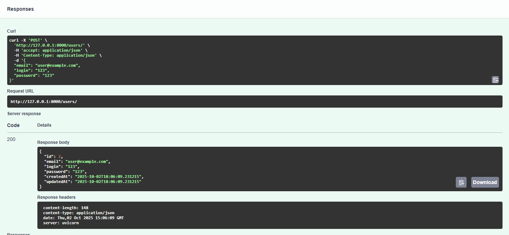
Чтение пользователя (успешное)

Чтение пользователя (неуспешное)
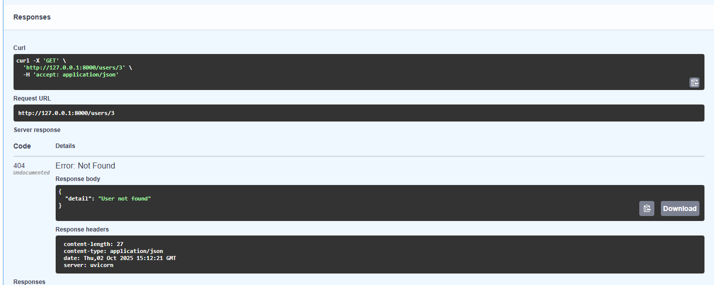
Обновление пользователя (успешное)

Обновление пользователя (неуспешное)

Удаление пользователя (успешное)
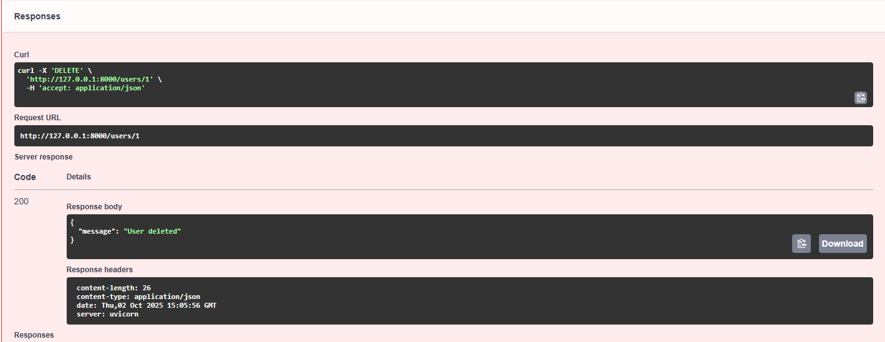
Удаление пользователя (неуспешное)
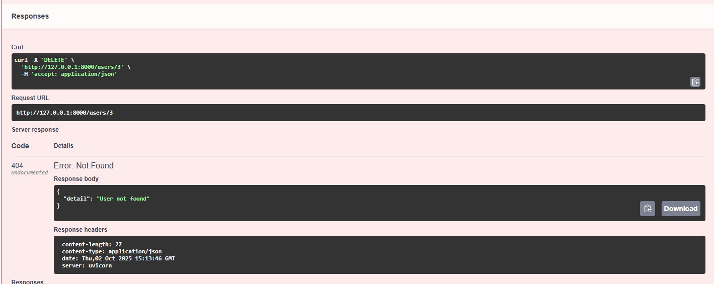
Создание поста
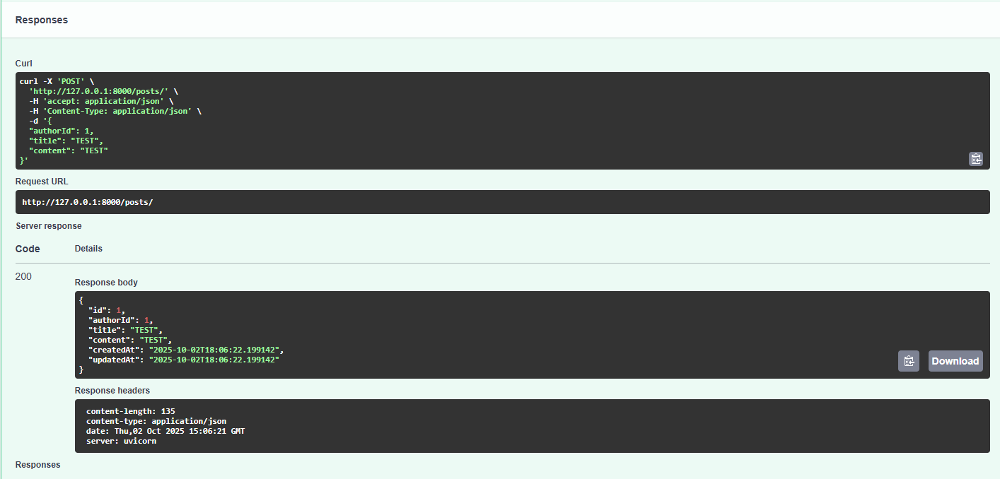
Чтение поста (успешное)
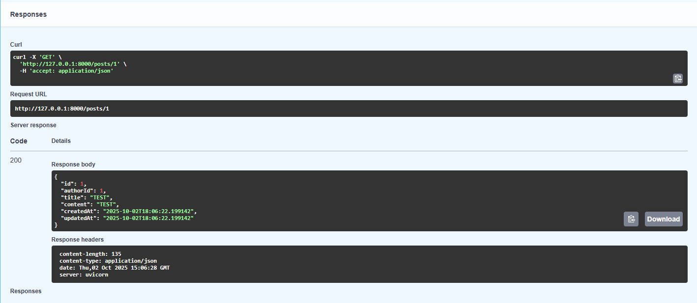
Чтение поста (неуспешное)
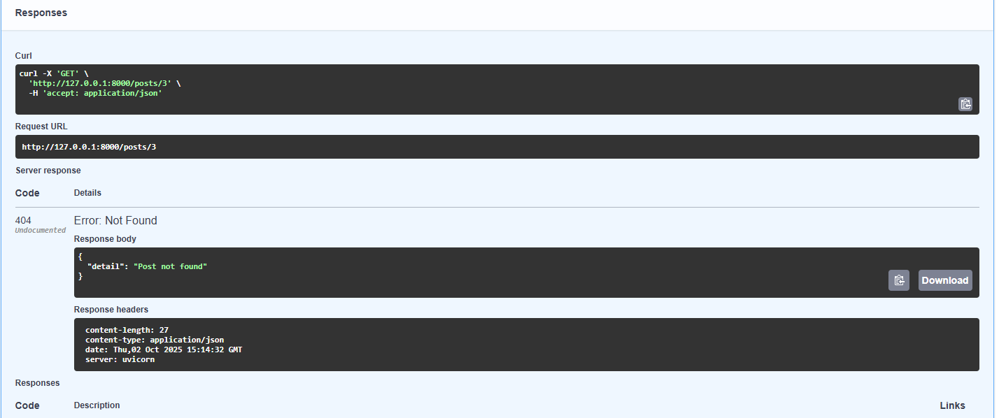
Обновление поста (успешное)
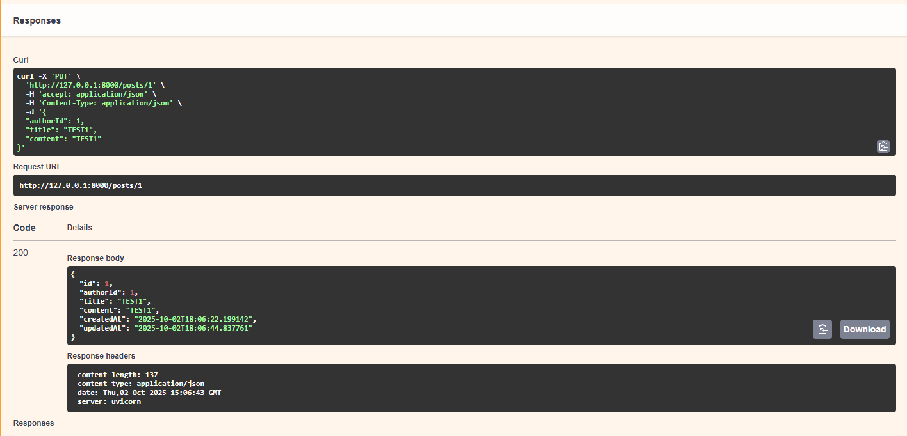
Обновление поста (неуспешное)

Удаление поста (успешное)
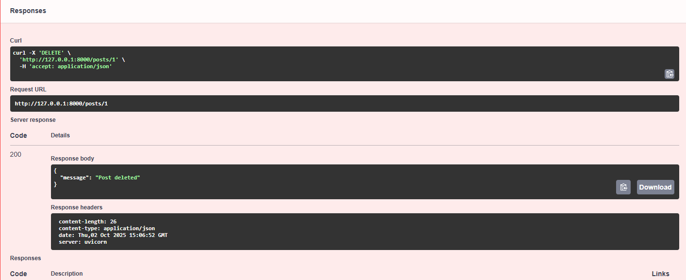
Удаление поста (неуспешное)
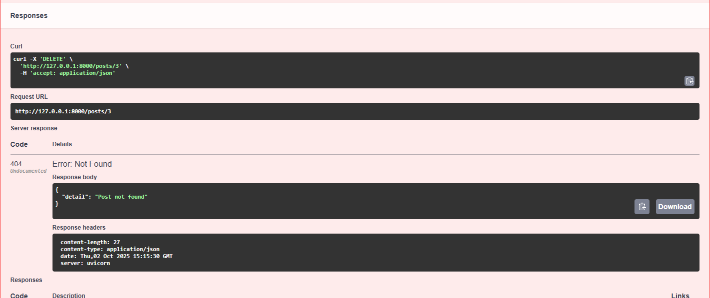

Er-диаграмма
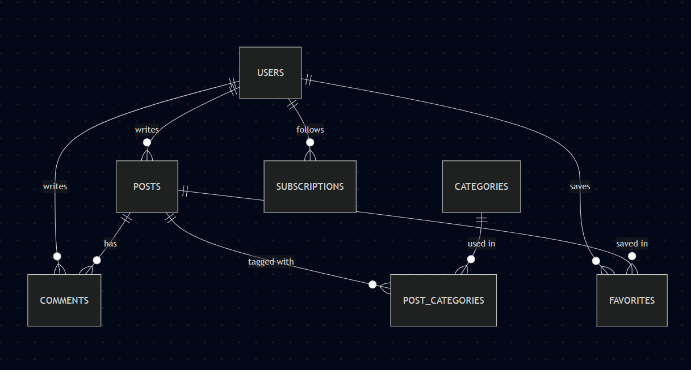

Выполненные критерии:

Фронтенд

1. Регистрация, аутентификация и страницы регистрации и входа
2. Страница профиля пользователя с возможностью редактирования информации собственного аккаунта
3. Главная страница с лентой постов
4. Страница создания поста
5. Возможность поиска постов по заголовку и тексту
6. Возможность поиска пользователей
7. Возможность оставлять оценку и комментарии к посту
8. Возможность сохранять и просматривать избранные посты
9. Валидация данных форм
10. Обработка серверных ошибок

Бэкенд

1. Хранение данных в БД
2. CRUD-операции для всех сущностей
3. Валидация входных данных и обработка ошибок
4. Авторизация и контроль доступа
5. Пагинация и фильтрация постов и пользователей (фильтрация и поиск)
6. Использование кэширования
7. Полнотекстовый поиск постов

Дополнительные требования

1. Смена темы сайта (светлая, тёмная и системная)
2. Интернационализация (интерфейс приложения на разных языках)